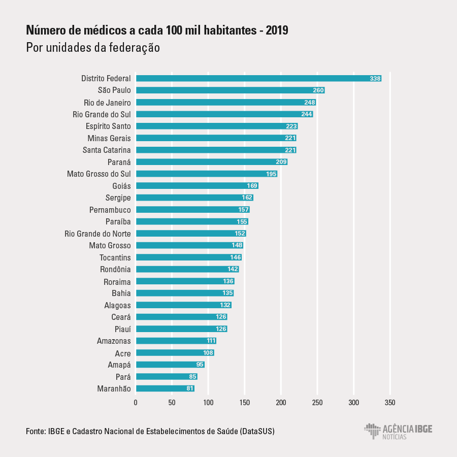

# Introdução
A tecnologia está cada vez mais presente na vida das pessoas, e na medicina não é diferente. Desde equipamentos que favorecem os diagnósticos dos pacientes até  simples agendamentos para a marcação de consultas. 

Grandes redes de clínicas e hospitais já possuem serviços e plataformas de agendamento on-line, e este número tende a crescer. Uma dessas, segundo o site saúde business em publicação de 2019, relatou que o site Doctoralia obteve nos últimos anos um crescimento maior que 700% nos agendamentos on-line. Em contrapartida, as pequenas e médias clínicas médicas, ao realizarem o agendamento dos seus usuários é comumente por outros meios, como ligações via telefone, agendamento manual e até presencialmente. Isso acarreta para os usuários, perda de tempo, ao ter que ligar para conferir a disponibilidade dos médicos, as especialidades atendidas, horários e valores das consultas. E, vale ressaltar, que há horário restrito para o cliente sanar suas dúvidas e realizar o agendamento, para os médicos e clínicas, geram dificuldades no gerenciamento das rotinas e segurança da informação. Sendo um processo mais propenso a erros, como sobreposição de horários ou marcação de especialidade que não é necessidade do cliente, como também aumentos dos custos operacionais e dos recursos.

Além do impacto que pode causar, ao procurar um atendimento médico o usuário pode estar fragilizado, e esses percalços trazem maiores desgastes e uma experiência negativa do cliente.

Portanto, é necessário inserir as pequenas e médias clínicas médicas no contexto tecnológico, de uma forma que facilite os agendamentos na marcação de consultas, tornando soluções mais práticas, ágeis que facilite a prestação dos serviços aos clientes. 

## Problema
Os sistemas de agendamento online tendem a crescer, sendo assim as clínicas médicas não podem se ausentar para essa tecnologia. Logo, o problema que se busca resolver com este projeto é: a limitação de recursos automatizados para agendamento de consultas, ausência no acesso ao histórico detalhado das consultas e a mobilidade da agenda do profissional médico. 

> **Links Úteis**:
> - [Objetivos, Problema de pesquisa e Justificativa](https://medium.com/@versioparole/objetivos-problema-de-pesquisa-e-justificativa-c98c8233b9c3)
> - [Matriz Certezas, Suposições e Dúvidas](https://medium.com/educa%C3%A7%C3%A3o-fora-da-caixa/matriz-certezas-suposi%C3%A7%C3%B5es-e-d%C3%BAvidas-fa2263633655)
> - [Brainstorming](https://www.euax.com.br/2018/09/brainstorming/)

## Objetivos

O objetivo deste trabalho é a criação de um site que permita as clínicas de pequeno e médio porte, e aos médicos que cadastrem seus serviços e disponibilize para que clientes possam agendar as consultas totalmente on-line. 
Os objetivos específicos são:
 *Permitir que as clínicas e/ou médicos cadastrem as especialidades atendidas, com seus respectivos horários de atendimento;
 *Fornecer funcionalidades que o cliente (paciente) possa se cadastrar e agendar as consultas na clínica. Este agendamento, sendo feito conforme a sua necessidade, optando pela especialidade, médico, dia e horário requerido. 
 *Permitir a personalização dos atendimentos com histórico de consulta, retornos, agendamentos/reagendamentos e a interação médico/paciente. 
 
> **Links Úteis**:
> - [Objetivo geral e objetivo específico: como fazer e quais verbos utilizar](https://blog.mettzer.com/diferenca-entre-objetivo-geral-e-objetivo-especifico/)

## Justificativa

Ao observar a lacuna existente na inserção das pequenas e médias clínicas no agendamento on-line, notou-se a viabilidade de elaborar um site onde estes possam se cadastrar. No que lhe diz respeito, deve ter utilidade para os médicos e administradores de pequenas e médias clínicas e para todo o público em que estas se destinam. O projeto também busca otimizar o tempo no que se refere ao agendamento e, detalhar o histórico de consultas por ambas as partes. Segundo o site do IBGE, no artigo de Alexandre Barros publicado em maio de 2020, o número de médicos no Brasil cresce exponencialmente, conforme a tabela a seguir.

 

Observa-se o número de médico a cada 100 mil habitantes por unidade de federação, o que justifica a necessidade de uma plataforma que atenda a demanda de mercado. A automatização dos processos por softwares clínicos pode ser entendida como a otimização de atividades, antes realizadas de forma manual e com grande número de erros. 
O agendamento on-line de consultas irá reverter consideravelmente o número de cancelamentos, pois a plataforma possibilita selecionar a data conforme a disponibilidade do paciente. Portanto, as chances de não comparecimento reduzirão, assim como os formulários em papel, tornando a empresa sustentável.
Quanto a praticidade do cliente, segundo PNAD Contínua do IBGE sobre tecnologia mostra que o uso do celular continua crescente no Brasil, em um ano houve um crescimento percentual de quase 2%, considerável em um país emergente. De porte de tal ferramenta, a praticidade de utiliza-la para agendamentos é indiscutível, faz desta uma jurisdição coerente com os dados apresentados.

> **Links Úteis**:
> - [Como montar a justificativa](https://guiadamonografia.com.br/como-montar-justificativa-do-tcc/)

## Público-Alvo
O projeto foi desenvolvido com foco nos médicos e administradores de pequenas e médias clínicas que buscam pela digitalização e também em seus usuários, que necessitam de uma relação mais prática e tecnológica com a empresa. 

> **Links Úteis**:
> - [Público-alvo](https://blog.hotmart.com/pt-br/publico-alvo/)
> - [Como definir o público alvo](https://exame.com/pme/5-dicas-essenciais-para-definir-o-publico-alvo-do-seu-negocio/)
> - [Público-alvo: o que é, tipos, como definir seu público e exemplos](https://klickpages.com.br/blog/publico-alvo-o-que-e/)
> - [Qual a diferença entre público-alvo e persona?](https://rockcontent.com/blog/diferenca-publico-alvo-e-persona/)
