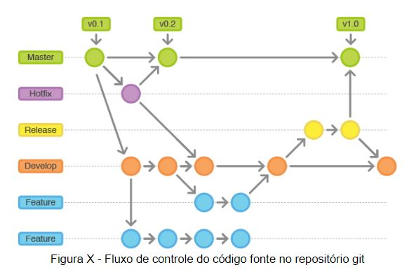
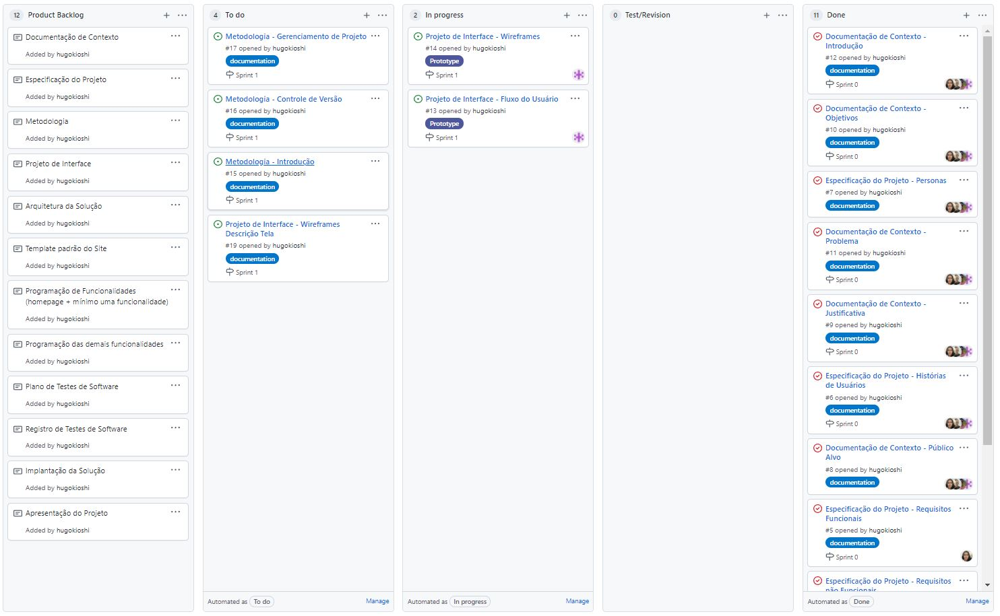

# Metodologia

Pré-requisitos: <a href="2-Especificação do Projeto.md"> Documentação de Especificação</a>

A  metodologia  contempla  as  definições  de  ferramental  utilizado  pela  equipe  tanto  para  a manutenção dos códigos e demais artefatos quanto para a organização do time na execução das tarefas do projeto.

## Relação de Ambientes de Trabalho
Os artefatos do projeto são desenvolvidos a partir de diversas plataformas e a relação dos ambientes com seu respectivo propósito é apresentada na tabela que se segue.

Ambiente  | Plataforma  | Link de Acesso
--------- | ----------- | ---------------
Repositório de código fonte  | GitHub  | https://github.com/ICEI-PUC-Minas-PMV-ADS/pmv-ads-2021-2-e1-proj-web-t5-g2-agendamento-consultas-medicas
Documentos do projeto        | GitHub  | https://github.com/ICEI-PUC-Minas-PMV-ADS/pmv-ads-2021-2-e1-proj-web-t5-g2-agendamento-consultas-medicas/tree/main/docs
Projeto de Interface e  Wireframes | MarvelApp  | https://marvelapp.com/prototype/5ee8e90
Gerenciamento do Projeto  | GitHub  | https://github.com/ICEI-PUC-Minas-PMV-ADS/pmv-ads-2021-2-e1-proj-web-t5-g2-agendamento-consultas-medicas/projects

## Gestão de código-fonte

Para  a gestão do  código-fonte  do  software  desenvolvido  pela  equipe,  o  grupo  utiliza  um processo  baseado  no  Git  Flow  abordado  por  Vietro  (2015),  mostrado  na  Figura  a  seguir. Desta  forma,  todas  as  manutenções  no  código  são  realizadas  em  branches  separados, identificados  como  Hotfix,  Release,  Develop  e  Feature.  Uma  explicação  rápida  sobre  este processo é apresentada no vídeo "The gitflow workflow - in less than 5 mins".

## Gerenciamento de Projeto

### Divisão de Papéis

Apresente a divisão de papéis entre os membros do grupo.

#### Scrum Master:
- Hugo Kioshi Ito

#### Product Owner:
- Gabriel Dantas

#### Developer:
- Fabio Furlan
- Luiza Lobato

#### UX/UI Designer
 - Fabio Furlan
 - Luiza Lobato

Para  organização  e  distribuição  das  tarefas  do  projeto,  a  equipe  está  utilizando o Projects do github estruturado com as seguintes listas: 

- Product Backlog:  recebe  as  tarefas  a  serem  trabalhadas  conforme cronograma e os entregáveis. Todas  as  atividades  identificadas  no  decorrer  do  projeto  também  devem  ser incorporadas a esta lista.
- To  Do:  Esta  lista  representa  o  Sprint  Backlog.  Este  é  o  Sprint  atual  que  estamos trabalhando.
- In progress: Quando uma tarefa tiver sido iniciada, ela é movida para cá.
- Test/Revision: Checagem de Qualidade. 
- Done: nesta lista são colocadas as tarefas que passaram pelos testes e controle de qualidade  e  estão  prontos  para  ser  entregues  ao  usuário.  Não  há  mais  edições  ou revisões necessárias, ele está agendado e pronto para a ação.

O quadro kanban do grupo no Projects está disponível através da URL https://github.com/ICEI-PUC-Minas-PMV-ADS/pmv-ads-2021-2-e1-proj-web-t5-g2-agendamento-consultas-medicas/projects/1 e é apresentado, no estado atual, na Figura X.

Figura X - Tela do kanban utilizada pelo grupo
