# Projeto de Interface

Pré-requisitos: <a href="2-Especificação do Projeto.md"> Documentação de Especificação</a>

Visão geral da interação do usuário pelas telas do sistema e protótipo interativo das telas com as funcionalidades que fazem parte do sistema (wireframes).

 Apresente as principais interfaces da plataforma. Discuta como ela foi elaborada de forma a atender os requisitos funcionais, não funcionais e histórias de usuário abordados nas <a href="2-Especificação do Projeto.md"> Documentação de Especificação</a>.

## Fluxo do Usuário
O diagrama apresentado na Figura 1 e na Figura 2 mostra o fluxo de interação do usuário pelas telas do sistema. Cada uma das telas deste fluxo é detalhada na seção de Wireframes que se segue. Para visualizar o wireframe interativo, acesse o <https://marvelapp.com/prototype/5ee8e90> .

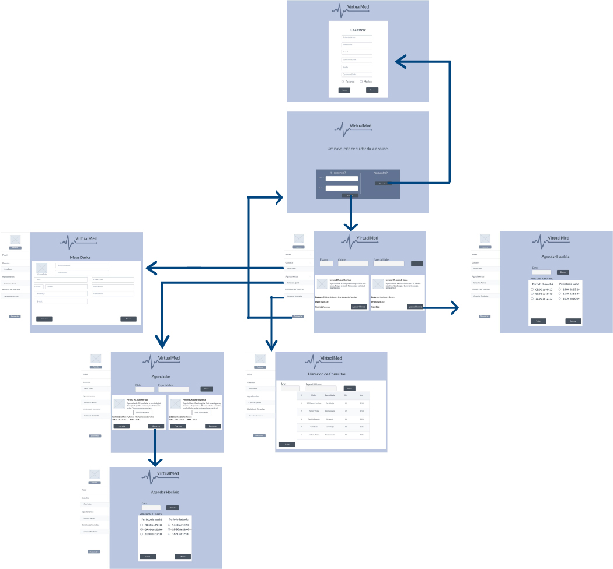
Figura 1 - Fluxo de telas do paciente

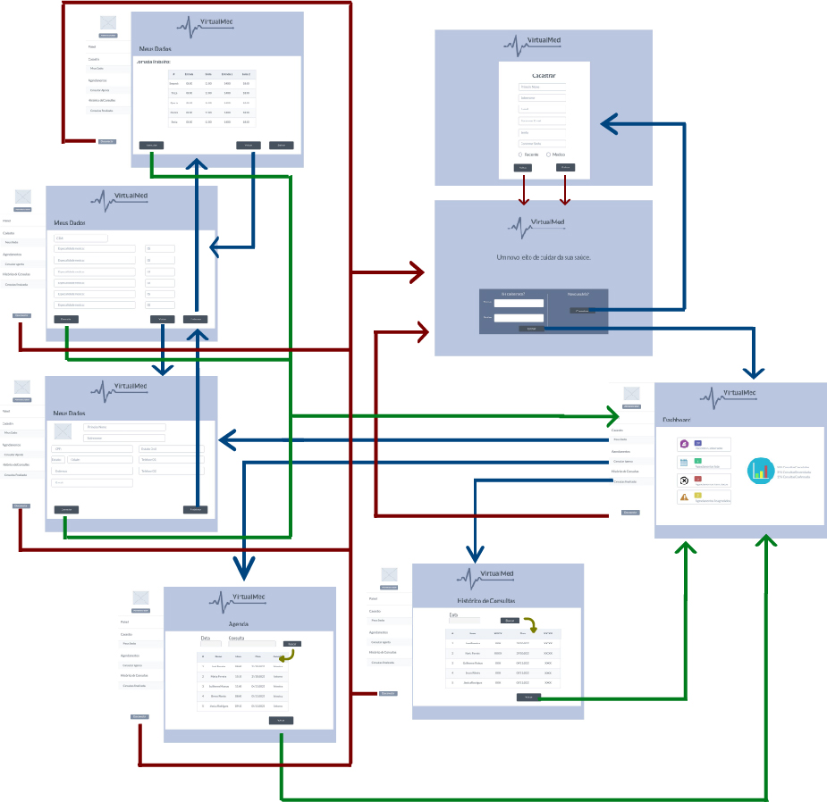
Figura 2 - Fluxo de telas do Administrador/Medico

## Wireframes

### Tela - Home-Page

### Tela - Cadastro de Usuário
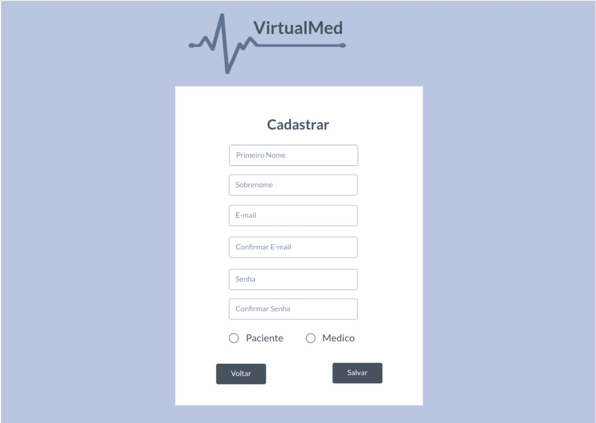

### Tela - Portal de Consulta Paciente
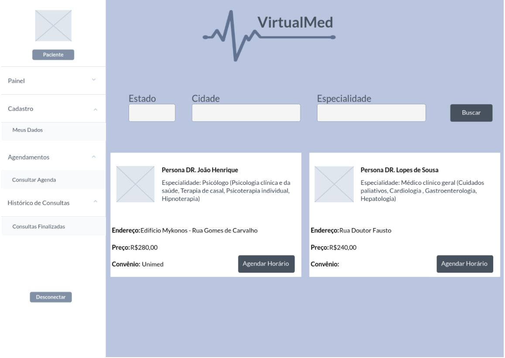

### Tela - Agenda Horário
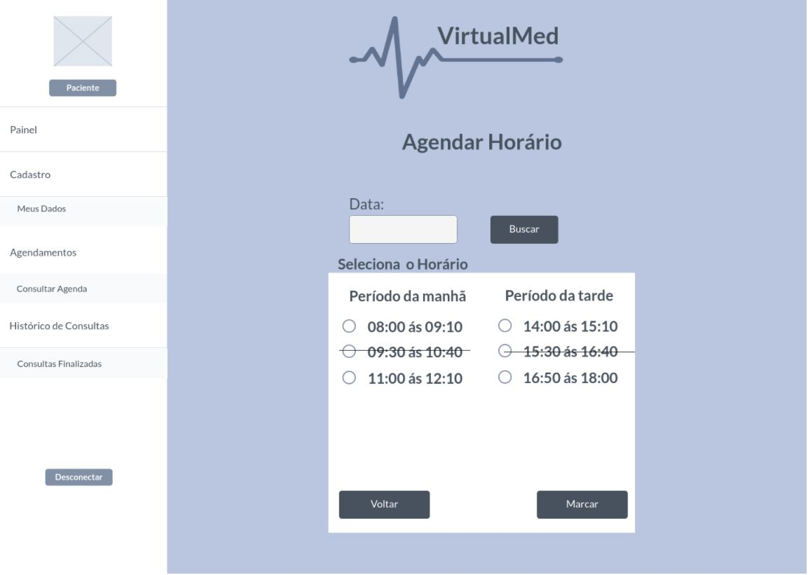

### Tela - Agenda Paciente
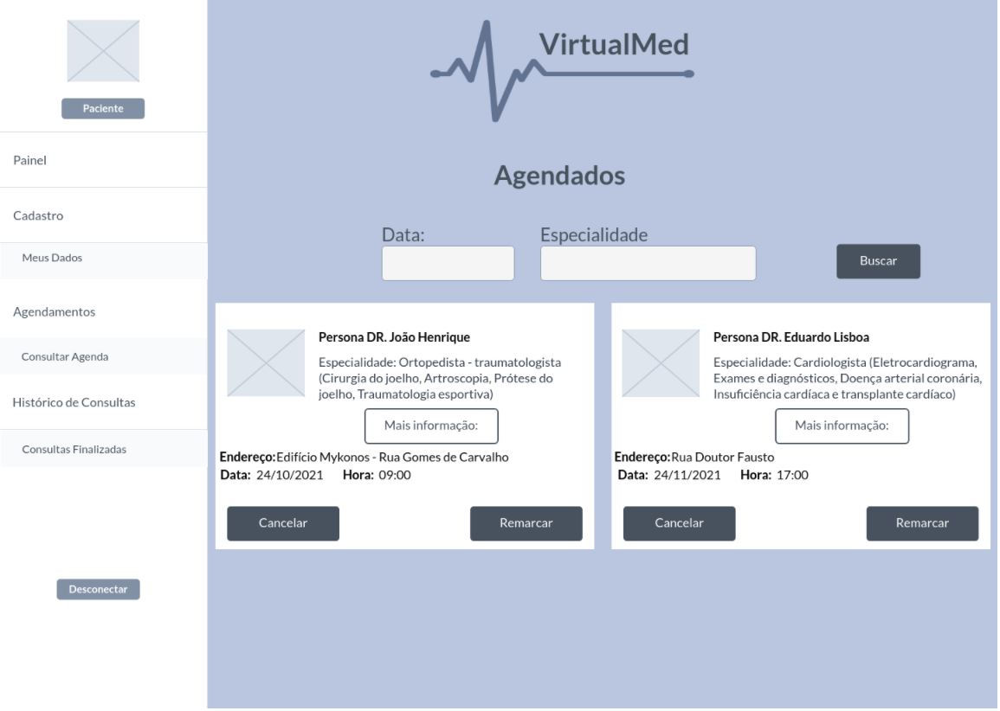

### Tela - Meu Cadastro
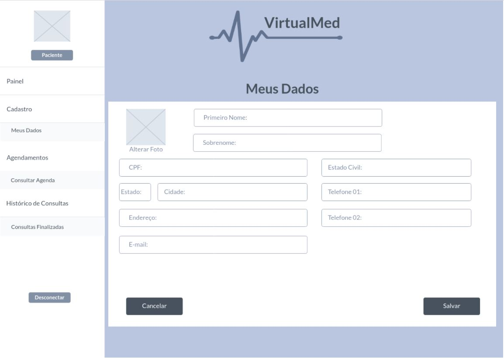

### Tela - Histórico de Consultas

### Tela - Portal de Consulta Administrador
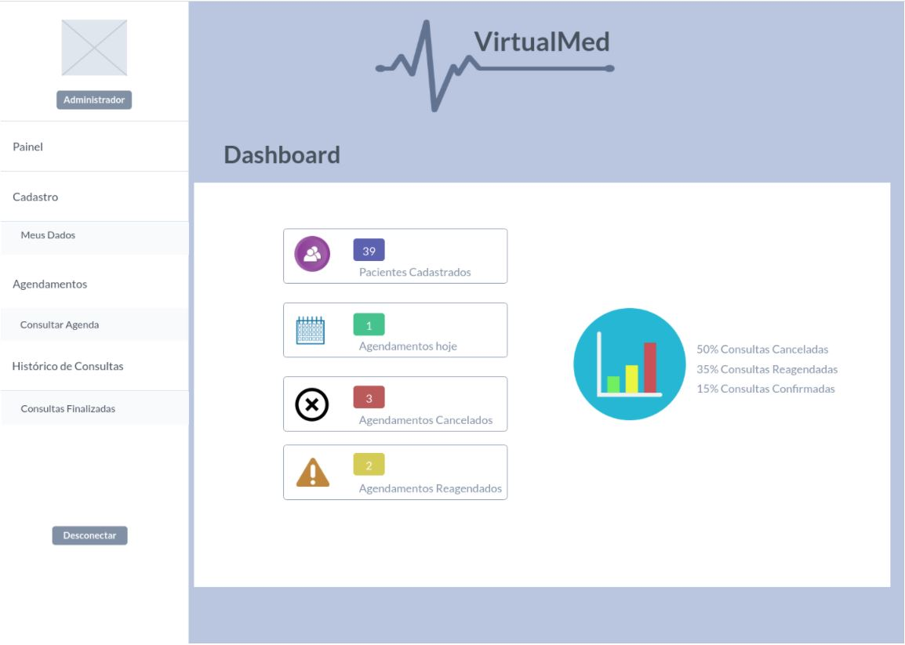

### Tela - Cadastro Medico
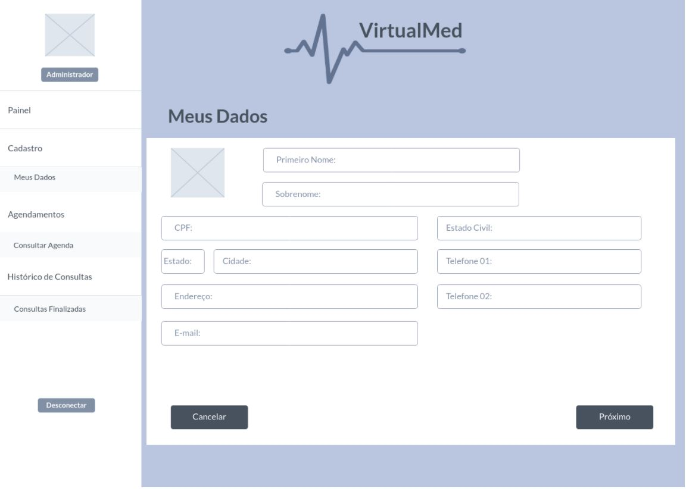

### Tela - Cadastro Medico - Especialidade/Preço
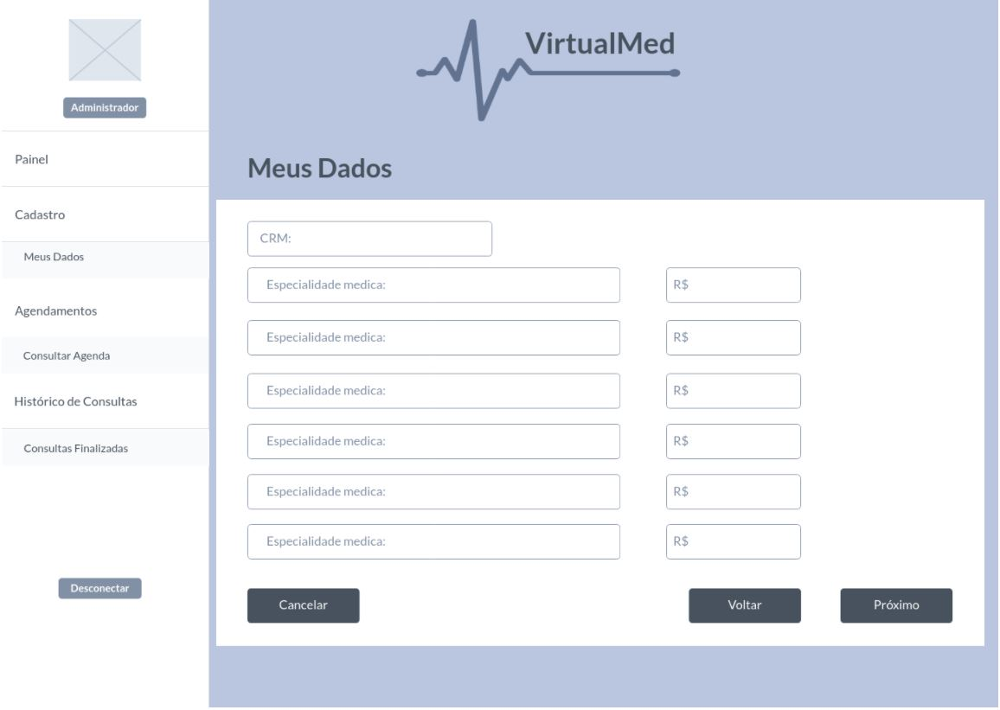

### Tela - Cadastro Medico - Jornada
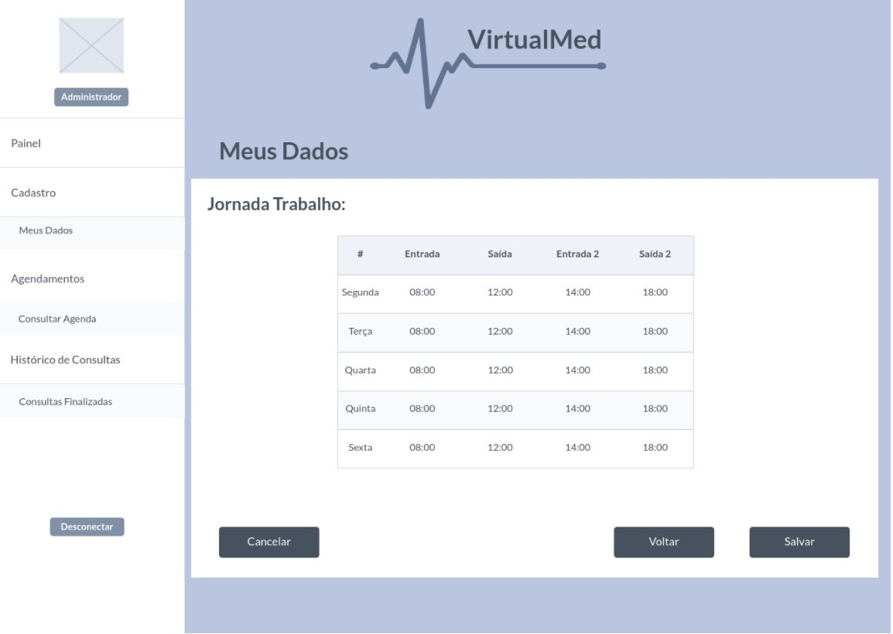

### Tela - Cadastro Medico - Agenda
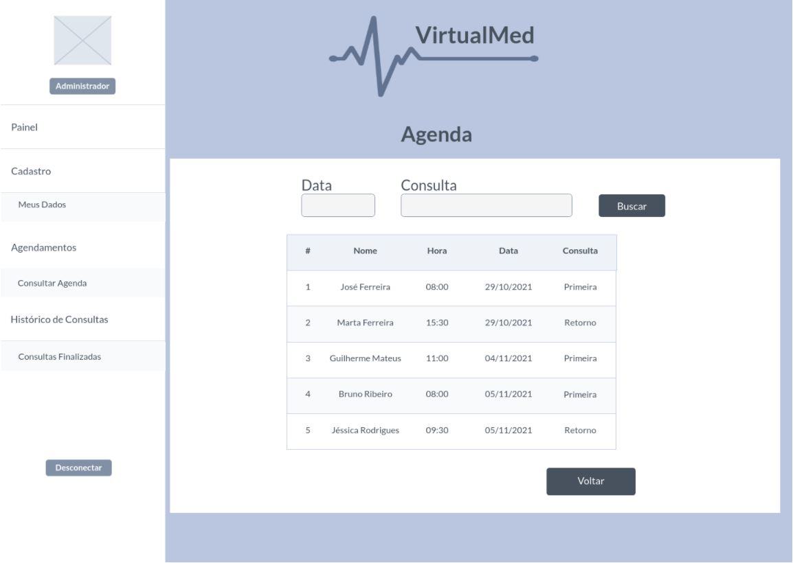

### Tela - Cadastro Medico - Historico Consulta

