# Projeto de Interface

Pré-requisitos: <a href="2-Especificação do Projeto.md"> Documentação de Especificação</a>

Visão geral da interação do usuário pelas telas do sistema e protótipo interativo das telas com as funcionalidades que fazem parte do sistema (wireframes).

 Apresente as principais interfaces da plataforma. Discuta como ela foi elaborada de forma a atender os requisitos funcionais, não funcionais e histórias de usuário abordados nas <a href="2-Especificação do Projeto.md"> Documentação de Especificação</a>.

## Fluxo do Usuário
O diagrama apresentado na Figura 1 e na Figura 2 mostra o fluxo de interação do usuário pelas telas do sistema. Cada uma das telas deste fluxo é detalhada na seção de Wireframes que se segue. Para visualizar o wireframe interativo, acesse o <https://marvelapp.com/prototype/5ee8e90> .

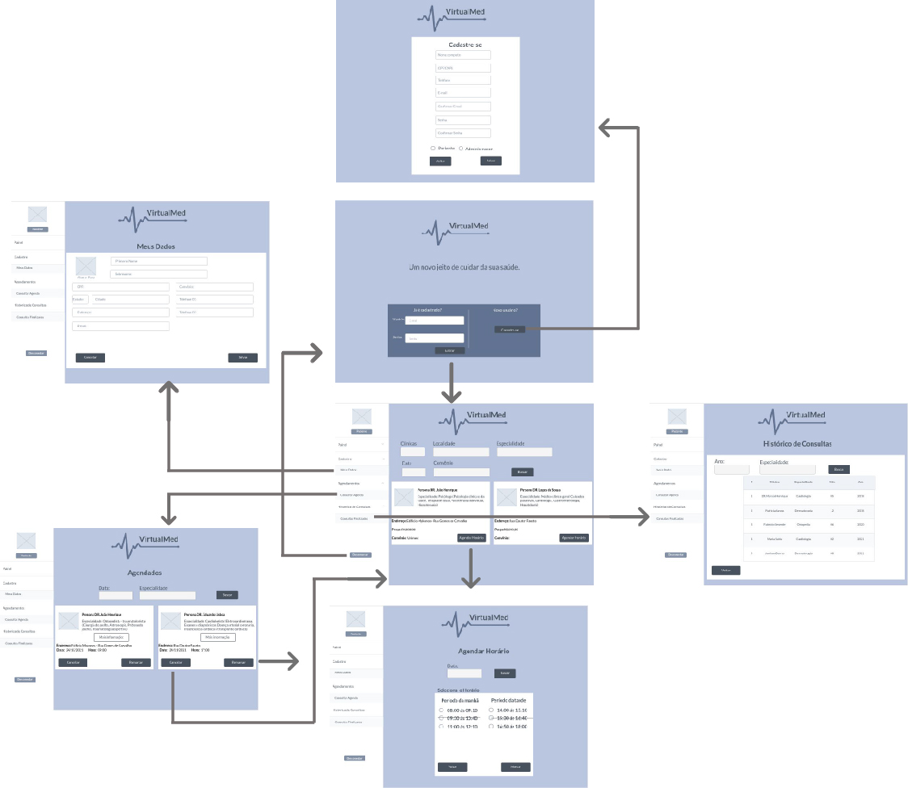

                                  Figura 1 - Fluxo de telas do paciente

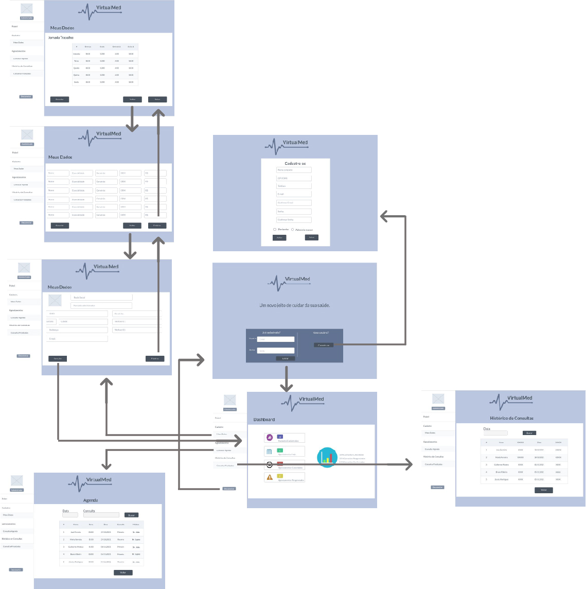

                                 Figura 2 - Fluxo de telas do Administrador/Medico

## Wireframes

### Tela - Home-Page
A tela de Home-Page permite que o usuário faça login, utilizando usuário e senha, ou se cadastre no site, utilizando a opção cadastre-se.

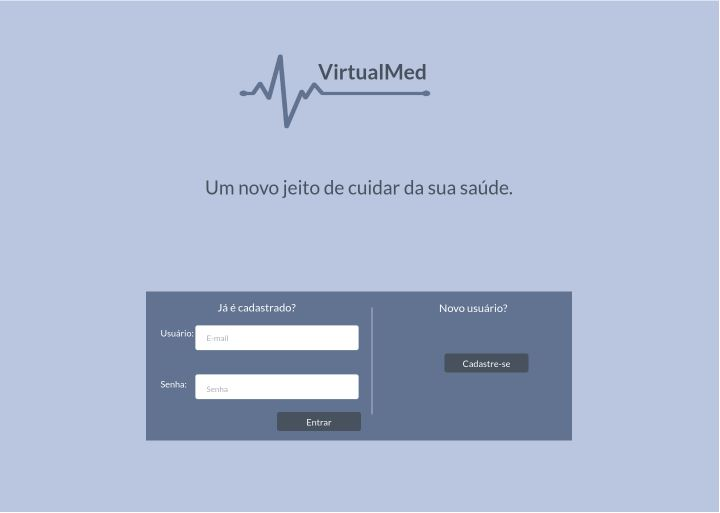

### Tela - Cadastro de Usuário
A tela Cadastro de Usuário permite que o usuário, seja paciente ou administrador, se cadastre no site preenchendo os dados solicitados e selecionando o tipo de cadastro paciente/administrador.

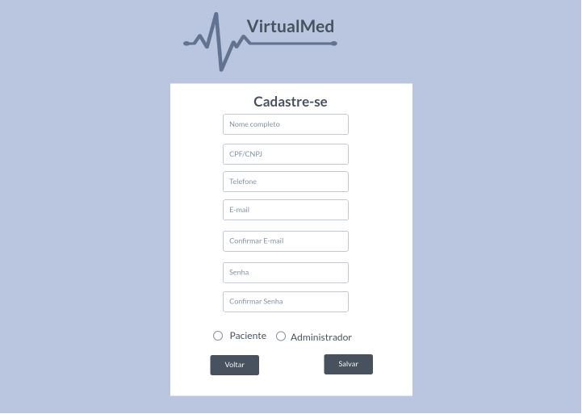

### Tela - Portal de Consulta Paciente
A tela Portal de Consulta Paciente, permite que o usuário utilize as ferramentas de pesquisa: Clínicas, Localidade, Especialidade, Data e Convênio para escolher a melhor opção para realizar o agendamento de sua consulta.

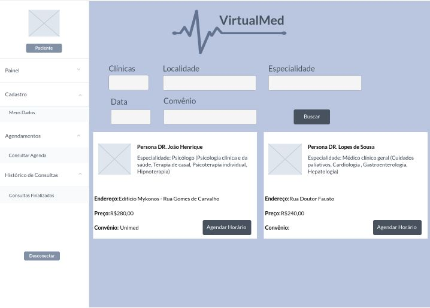

### Tela - Agenda Horário
A tela Agenda Horário, permite que o usuário utilize a ferramenta de pesquisa por data e selecione o horário desejado para o agendamento de sua consulta.

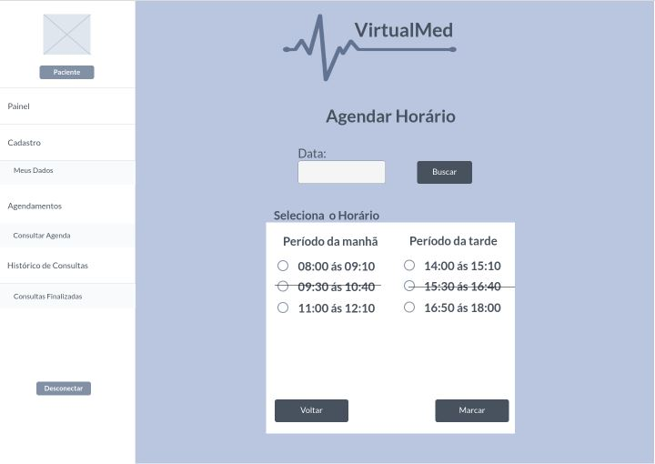

### Tela - Agenda Paciente
A tela Agenda Paciente, permite que o usuário vefifique suas consultas agendadas, cancele ou reagende.

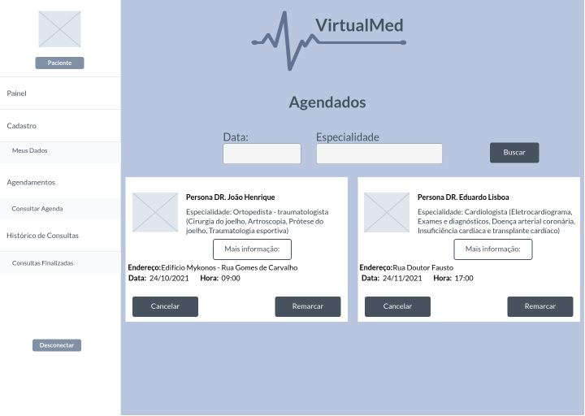

### Tela - Meu Cadastro
A tela Meu Cadastro, permite que o usuário paciente consulte seus dados e faça as alterações necessárias.

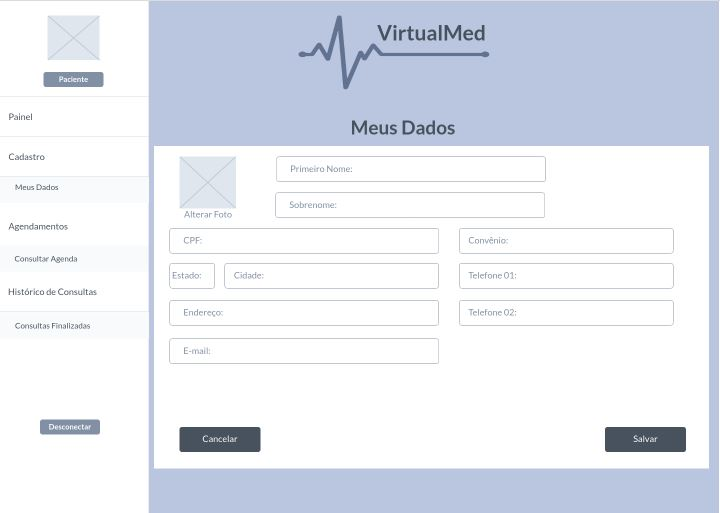

### Tela - Histórico de Consultas Paciente
A tela Histórico de Consultas Paciente, permite que o usuário consulte o histórico de suas consultas, possuindo as ferramentas de pesquisa: Especialidade e Ano.

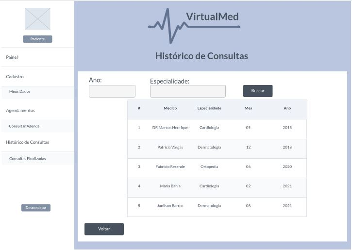

### Tela - Portal de Consulta Administrador
A tela Portal de Consulta Administrador, exibe um relatório com as seguintes informações: Pacientes cadastrados, Agendamentos hoje, Agendamentos Cancelados, Agendamentos Reagendados e um Gráfico com o percentual de consultas canceladas, reagendadas e confirmadas. 

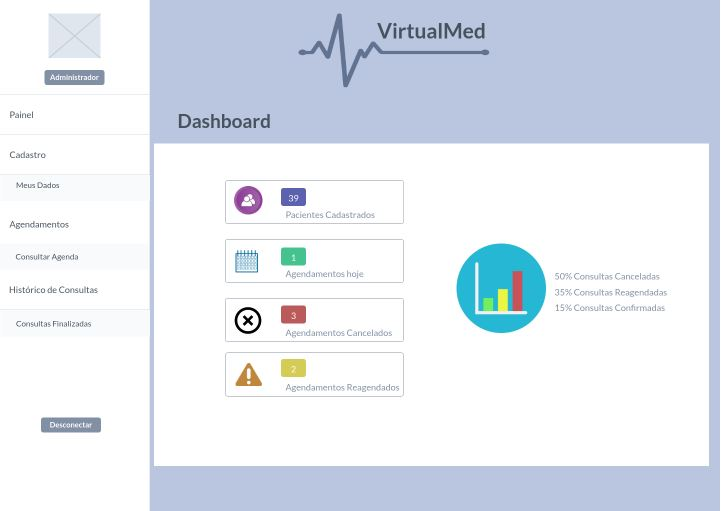

### Tela - Cadastro Administrador
A tela Cadastro Administrador, permite que o usuário administrador consulte seus dados e faça as alterações necessárias.

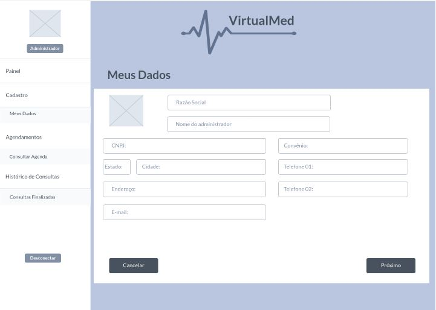

### Tela - Cadastro Medico - 
A tela Cadastro Medico, permite que o administrador cadastre os médicos vinculados preenchendo os campos: Nome, Especialidade, Convênio, CRM e R$.

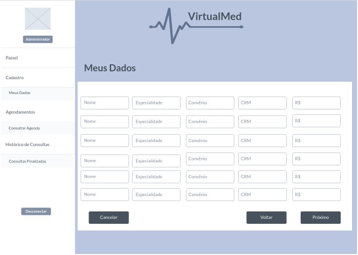

### Tela - Cadastro de Jornada
A tela Cadastro de Jornada, permite que o usuário administrador cadastre a jornada de trabalho da clínica.

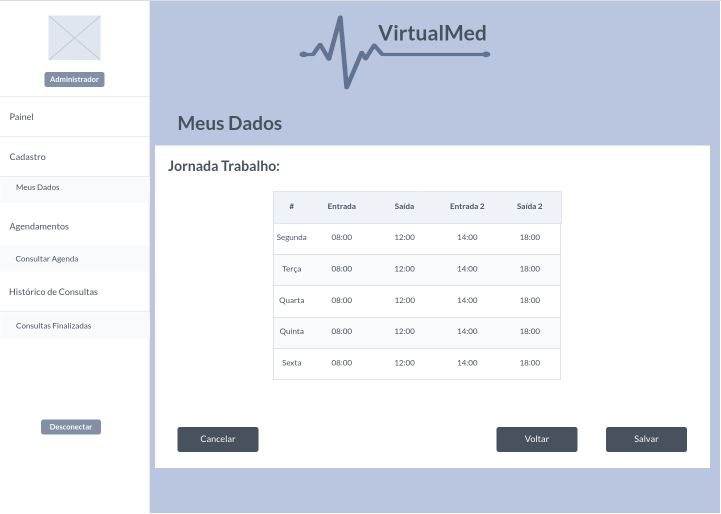

### Tela - Cadastro Administrador - Agenda
A tela Cadastro Administrador - Agenda, permite que o usuário administrador verifique os agendamentos da clínica. Nestes agendamentos é possível obter as seguintes informações: Nome do Paciente, Hora, Data, Consulta (primeira ou retorno), Médico.

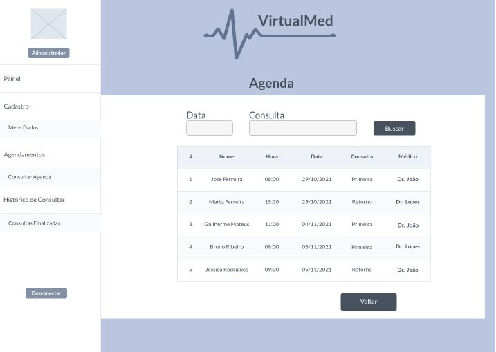

### Tela - Cadastro Administrador - Histórico Consulta
A tela Cadastro Administrador - Histórico Consulta permite que o usuário administrador consulte o histórico de consultas da clínica, possuindo a ferramenta de pesquisa: Data.

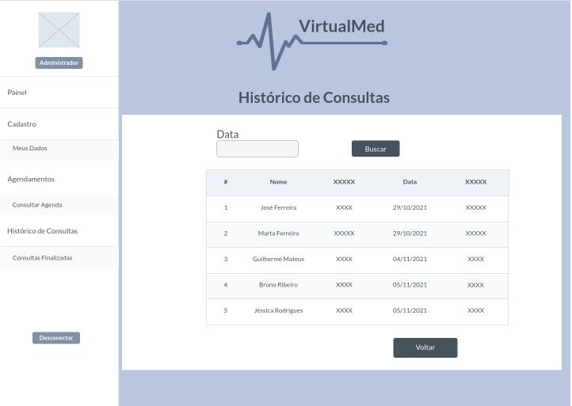
