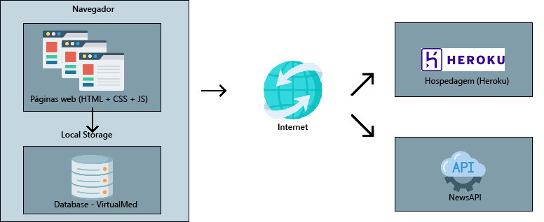

# Arquitetura da Solução

Nesta seção são apresentados os detalhes técnicos da solução criada pela equipe, tratando dos componentes que fazem parte da solução e do ambiente de hospedagem da solução.

## Diagrama de componentes

Os componentes que fazem parte da solução são apresentados na Figura que se segue.

Figura XX - Arquitetura da Solução

A solução implementada conta com os seguintes módulos:
- **Navegador** - Interface básica do sistema  
  - **Páginas Web** - Conjunto de arquivos HTML, CSS, JavaScript e imagens que implementam as funcionalidades do sistema.
   - **Local Storage** - armazenamento mantido no Navegador, onde são implementados bancos de dados baseados em JSON.
 - **News API** - plataforma que permite o acesso calendário.
 - **Hospedagem** - local na Internet onde as páginas são mantidas e acessadas pelo navegador. 

## Hospedagem

O site utiliza a plataforma do Heroku como ambiente de hospedagem do site do projeto. O site é mantido no ambiente da URL:
https://link_exemplo.herokuapp.com/

A publicação do site no Heroku é feita através de uma submissão do projeto (push) via git para o repositório remoto que se encontra no endereço: 
https://git.heroku.com/link_exemplo.git
