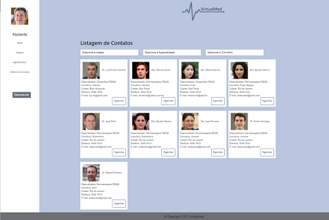
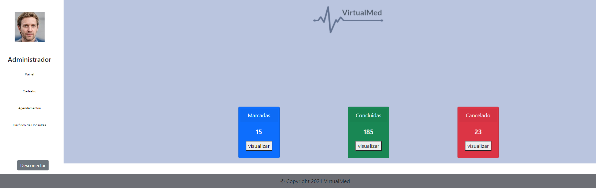

# Template padrão do site

O  padrão  de  layout  a  ser  utilizado  pelo  site  tem  correspondência  ao  projeto  de  Interface 
elaborado anteriormente.
O template criado está disponível no site https://icei-puc-minas-pmv-ads.github.io/pmv-ads-2021-2-e1-proj-web-t5-g2-agendamento-consultas-medicas/src/index.html.....  ou https://virtualmed.hugokioshi.repl.co/ e é composto pelos seguintes 
layouts: 
- Tela principal
- Painel Paciente
- Painel Administrador - Médico
A responsividade segue o padrão do Bootstrap

## Tela Principal
Tela que abrange apenas tela de login, onde deverá inserir usuário, senha e tipo de acesso. Conforme figura 1.

                Figura 1 - Tela Principal
                
                
## Painel Paciente
Layout com a exibição todas as visualizações iniciais do site, menu com painel de busca, editar meu cadastro, consultar agenda e historico de consultas.  Conforme figura 2.

                Figura2  - Tela Inicial Paciente
                
                
## Painel Médico
Layout com a exibição de um dashboard com quantidades de consultas concluídas, marcadas e canceladas, além do menu com mesmo padrão do paciente.  Conforme figura 3.

                Figura3  - Tela Inicial Médico

Pré-requisitos: <a href="2-Especificação do Projeto.md"> Especificação do Projeto</a>, <a href="3-Projeto de Interface.md"> Projeto de Interface</a>, <a href="4-Metodologia.md"> Metodologia</a>

Layout padrão do site (HTML e CSS) que será utilizado em todas as páginas com a definição de identidade visual, aspectos de responsividade e iconografia.

> **Links Úteis**:
>
> - [CSS Website Layout (W3Schools)](https://www.w3schools.com/css/css_website_layout.asp)
> - [Website Page Layouts](http://www.cellbiol.com/bioinformatics_web_development/chapter-3-your-first-web-page-learning-html-and-css/website-page-layouts/)
> - [Perfect Liquid Layout](https://matthewjamestaylor.com/perfect-liquid-layouts)
> - [How and Why Icons Improve Your Web Design](https://usabilla.com/blog/how-and-why-icons-improve-you-web-design/)
