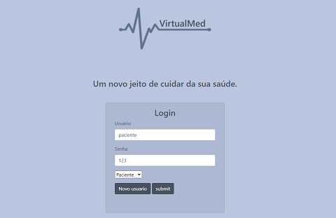

# Programação de Funcionalidades

Nesta seção são apresentadas as telas desenvolvidas para cada uma das funcionalidades do sistema. O respectivo endereço (URL) e outras orientações de acesso são são apresentadas na sequência.

## Pagina Inicial (RF-01, RF-02 e RF-03)
A tela principal do sistema apresenta login, senha e tipo de acesso. 
Os dados cadastrados e carregados são armazenadas no LocalStorage com estruturas dados baseada em JSON. Um 
exemplo da tela é apresentada na Figura 1.

                Figura 1 - Tela Principal
                
### Requisitos atendidos
- RF-01
- RF-02
- RF-03

### Artefatos da funcionalidade
- index.html
- login.js
- style-Index.css
- logo.png

> **Links Úteis**:
>
> - [Trabalhando com HTML5 Local Storage e JSON](https://www.devmedia.com.br/trabalhando-com-html5-local-storage-e-json/29045)
> - [JSON Tutorial](https://www.w3resource.com/JSON)
> - [JSON Data Set Sample](https://opensource.adobe.com/Spry/samples/data_region/JSONDataSetSample.html)
> - [JSON - Introduction (W3Schools)](https://www.w3schools.com/js/js_json_intro.asp)
> - [JSON Tutorial (TutorialsPoint)](https://www.tutorialspoint.com/json/index.htm)
