# Registro de Testes de Software

Pré-requisitos: <a href="3-Projeto de Interface.md"> Projeto de Interface</a>, <a href="8-Plano de Testes de Software.md"> Plano de Testes de Software</a>

Relatório com as evidências dos testes de software realizados no sistema pela equipe, baseado em um plano de testes pré-definido.

###                   CT-01 Login
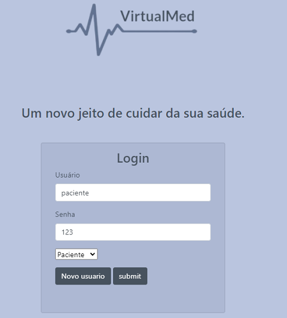

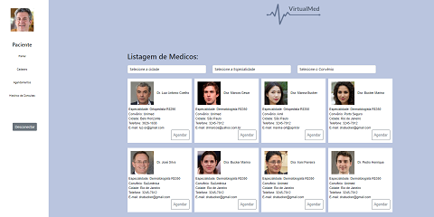

###                   CT-02 Login - Restrição de Acesso

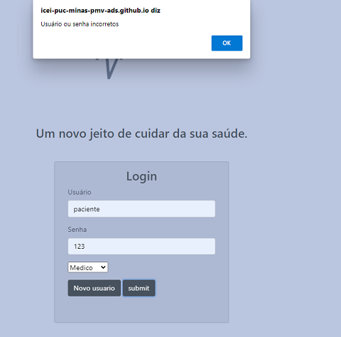
                      
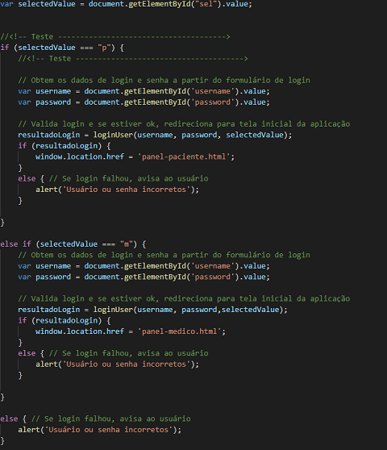

                  Codigo Validação

###                     CT-03 Login - Campo em branco
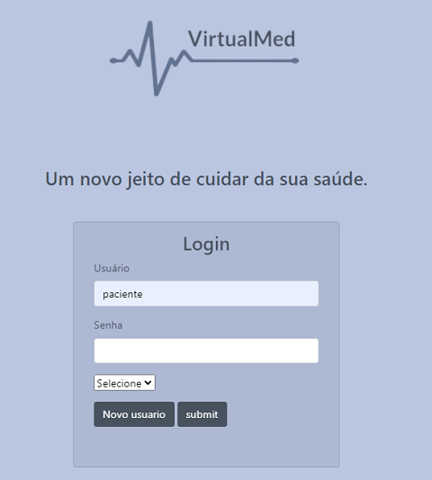

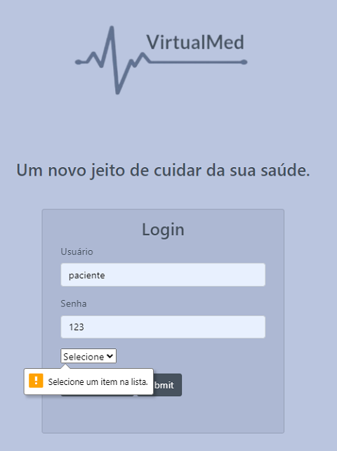

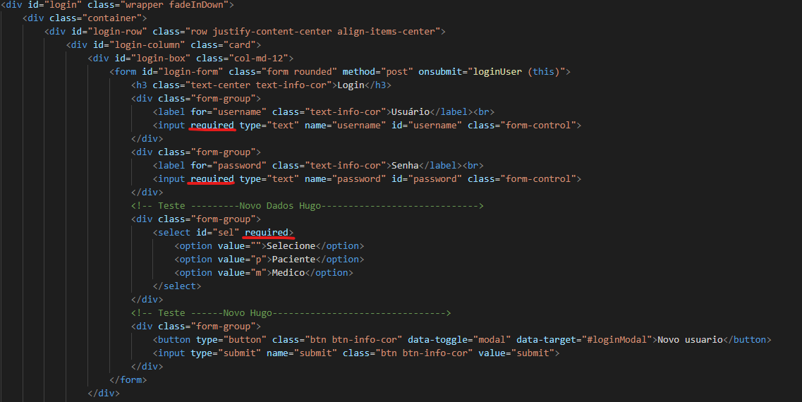

                Codigo Validação
                
                
###                     CT-04 Alterar algum dados do médico

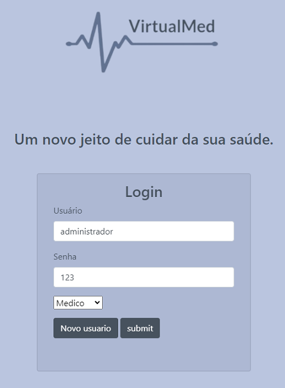

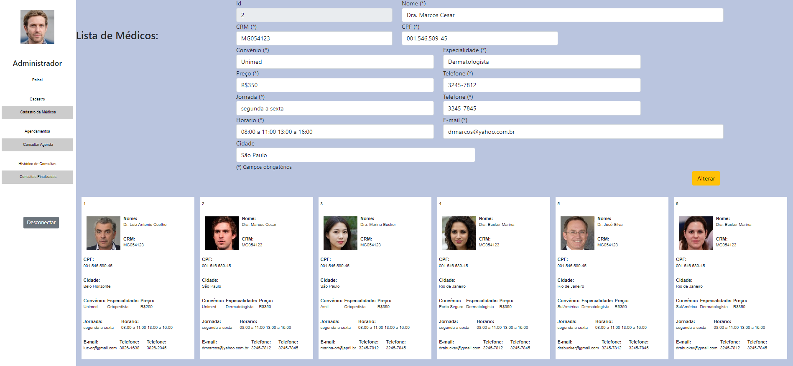

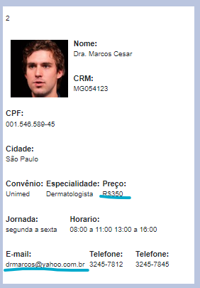

###                     CT-05 Visualizar alteração do médico no painel do paciente

###                     CT-06 Dashboard administrador clicar no botão e visualizar dados

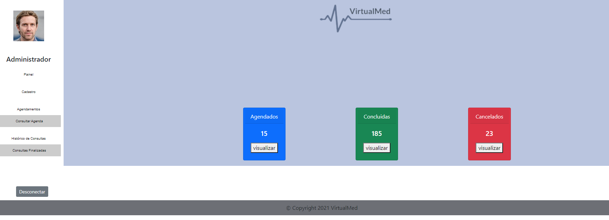

## Avaliação

Discorra sobre os resultados do teste. Ressaltando pontos fortes e fracos identificados na solução. Comente como o grupo pretende atacar esses pontos nas próximas iterações. Apresente as falhas detectadas e as melhorias geradas a partir dos resultados obtidos nos testes.

> **Links Úteis**:
> - [Ferramentas de Test para Java Script](https://geekflare.com/javascript-unit-testing/)
